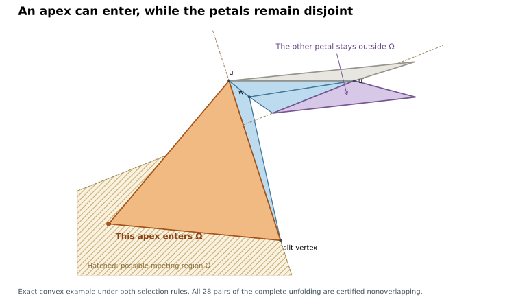

# An exhaustive opposite-petal partition

Continuation, 9 September 2026. This supplies a missing reduction in the
octahedron argument. It does **not** prove the remaining small-fan-angle case
or Lemma L.

**Latest correction:** the proposed exclusion of each individual apex is false
even for a strictly convex octahedron under H and R. The exact witness and
its successful net are described below. The base-cone partition remains valid.

The unqualified D-lemma is false, including for a sharpest apex. Nevertheless,
the large-angle regimes can be treated without it. The elementary base-cone
lemma below gives a complete partition, including equality boundaries.

## Angles and actual sectors

Take three consecutive fan faces `W_i,W_j,W_{j+1}`, where `j=i+1`, and the
corresponding petals. Set `u=u_j`, `u'=u_{j+1}`. Put `u=(0,0)`, `u'=(ell,0)`,
with the middle petal `V_j` above the base and `W_j` below it; a reflection is
allowed when choosing these plane coordinates. Let

```
phi, psi = the two base angles of V_j
nu       = the apex angle of V_j
kappa    = kappa_u + kappa_u'
alpha    = phi + kappa_u
beta     = psi + kappa_u'
sigma    = angle_u W_i + angle_u W_j
tau      = angle_u' W_j + angle_u' W_{j+1}
a        = angle_u V_i
b        = angle_u' V_{j+1}.
```

All are positive; `a,b<pi`. The complete angle sums at the two uncut base
copies give

```
alpha + sigma + a = 2 pi
beta  + tau   + b = 2 pi
alpha + beta = pi - nu + kappa.
```

In particular `alpha,beta,sigma,tau<2 pi`. The actual base cone of the left
petal has its directions in

```
I = [alpha, 2 pi - sigma],
```

and the right cone, based at `u'`, has directions

```
J = [pi + tau, 3 pi - beta].
```

These are unwrapped intervals of widths `a,b<pi`. They remain valid when
`alpha` or `beta` reaches or exceeds pi. Reversing the right cone gives the
direction interval `[tau, 2 pi-beta]` modulo a full turn.

## Base-cone lemma

**If `alpha+beta >= pi` and `sigma+tau >= pi`, the two base cones are disjoint.**
No curvature-ranking assumption is needed.

Proof. The left cone and the reversed right cone are contained in the sector

```
S = [m, 2 pi-n],
m = min(alpha,tau),   n = min(sigma,beta).
```

Their own triangle-angle identities give `alpha+sigma>pi` and `tau+beta>pi`.
Consequently

```
m+n = min(alpha+sigma, alpha+beta, tau+sigma, tau+beta) >= pi.
```

Thus `S` is a closed convex sector of width at most pi. Because `m,n>0`, it
does not contain the positive base direction. The difference of a vector in
the left cone and one in the right cone belongs to `S`. If the two translated
cones met, that difference would equal `u'-u=(ell,0)`, which is impossible.
This proves disjointness, and in particular excludes interior overlap of the
two triangles. The argument includes equality in either displayed hypothesis.

## Complete partition

The two strict alternatives below cannot both occur: summing the two
triangle-angle identities gives
`alpha+beta+sigma+tau = 4 pi-a-b > 2 pi`.

| Region | Conclusion / remaining obligation |
|---|---|
| `alpha+beta < pi`, equivalently `kappa<nu` | Case A. The existing sharpest-apex, no-wrap, and apex-cone proof applies. Here `sigma+tau>pi`. |
| `alpha+beta >= pi` and `sigma+tau >= pi` | The base-cone lemma above excludes overlap, with no ranking hypothesis. |
| `sigma+tau < pi` | Necessarily `alpha+beta>pi`, hence strict Case B. Both fan angles are below pi. This is the sole remaining opposite-petal regime under (H). |

In particular, `kappa=nu` and `sigma+tau=pi` leave no equality case open.
The separate comparisons `alpha<pi`, `alpha=pi`, `alpha>pi` (and likewise
for beta) no longer require separate proofs of an unrestricted D-lemma.

## The remaining region uses the outer wedge directly

When `sigma+tau<pi`, both sigma and tau lie in `(0,pi)`. Let A be the line
through `u,u_i` and C the line through `u',u_{j+2}`. Each outer petal is in the
closed half-plane beyond its own fan edge, away from w. The intersection
`Omega=H_A intersect H_C` is the downward wedge beyond `X=A intersect C`.
Its location follows from the two outer rays, whose base angles are sigma
and tau; no D-lemma is needed.

For the left petal, membership in `H_A` is automatic. Its base vertex u is
strictly outside `H_C`. It can therefore enter Omega only if its apex or its
far equator vertex is beyond C. The mirror statement holds on the right.
This is the existing apex/far-vertex reach classification, now with a complete
domain of applicability. The later direction lemma still needs its stated
near-X assumption; that separate qualification has not been removed.

The proposed individual-apex exclusion under (H) and the sharpest-neighbour
slit rule is now refuted by the witness below. The joint-petal problem remains
unproved. An argument using the fourth petal must also state any dependence
on Lemma L. These are the remaining obligations, rather than a missing
large-angle partition.

## An exact angle-and-length criterion for each remaining apex

The base coordinates above also give a useful scalar version of the two open
apex statements. Write `s=|vu|`, `s'=|vu'|`, and `ell=|uu'|`. In the remaining
region `Sigma=sigma+tau<pi`, the left apex is beyond the right outer-edge line
if and only if

```
Sigma+a < pi  and  s sin(Sigma+a) > ell sin(tau).
```

The right apex is beyond the left outer-edge line if and only if

```
Sigma+b < pi  and  s' sin(Sigma+b) > ell sin(sigma).
```

Proof for the left side: its apex is `s(cos(alpha),sin(alpha))`, and the
right outer ray has direction `pi+tau` from `(ell,0)`. Its signed determinant
is `s sin(tau-alpha)-ell sin(tau)`, positive on the side away from w.
The angle identities and `Sigma<pi` give `alpha>tau`, with
`alpha-tau=2 pi-Sigma-a` in `(0,2 pi)`. Positivity is possible precisely when
`Sigma+a<pi`; there `sin(tau-alpha)=sin(Sigma+a)`. The right side is its mirror.

The middle triangle's sine rule substitutes `s/ell=sin(psi)/sin(nu)` and
`s'/ell=sin(phi)/sin(nu)`. Hence these tests can be written entirely in face
angles, without developing the whole net. They are exact reformulations, not
proofs that the inequalities cannot occur under the selection rules. Unlike
the older far-vertex direction implication, they do not assume that a far
vertex is before X.

A new 2,000-octahedron numerical check tested the formulas on 42,168 triples.
All 356 sampled selected-rule triples in the remaining regime even satisfied
the stronger angle-only exclusions `Sigma+a>=pi` and `Sigma+b>=pi`. This
motivated a simpler candidate lemma at the time. The later convex example
below refutes its blanket version; the sample was not a proof. An exact rational
abstract angle assignment satisfies all triangle sums, strictly positive
curvatures, strict cone inequalities, and strict versions of both curvature
rankings while violating the left angle exclusion. Thus these linear facts
alone are insufficient; additional metric realizability information is needed.

```
python3 -m n6.angle_relaxation n6/results/apex-angle-relaxation.json
```

The checked assignment is an abstract angle countermodel, not a claimed convex
octahedron. It must not be described as a counterexample to the candidate
geometric lemma.

The continuation adds a precise metric compatibility test in
[INTRINSIC_METRIC.md](INTRINSIC_METRIC.md). The older angle countermodel forces
both sets of spokes to increase strictly around a closed cycle, so it cannot
share consistent edge lengths. Conversely, a new exact intrinsic metric shows
that matching edge lengths and the rankings do not suffice if the convex-vertex
cone conditions are dropped. A smaller algebraic query now retains both
ingredients; the first 900-second run timed out without settling the bound.

## The slit rule closes the two-apex branch, conditional on L

Let `s` be the slit vertex. Its maximum equator curvature gives
`4 pi <= kappa_v+4 kappa_s+kappa_w`. For any angle `nu_t` at `v`, the
convex-vertex cone inequality gives `nu_t <= pi-kappa_v/2`. Therefore

```
kappa_s+kappa_w-nu_t >= (kappa_v+3 kappa_w)/4 > 0.
```

In the historical `(a,a)` branch, both far equator vertices are before X, and
the existing hexagon lemma requires `nu_m>kappa_back` for a meeting, where
`kappa_back=kappa_s+kappa_w+kappa_ui`. The new bound rules this out. This
conclusion is conditional on L, as is the hexagon lemma. It does not exclude
branches where a far vertex is past X, and it does not prove that either apex
individually stays outside Omega.

## Exact nonempty large-angle example

The six integer points

```
0=(-2,-3, 2)   1=(-4,-2,-2)   2=(-2,0, 3)
3=( 1, 3, 0)   4=(-1, 3,-2)   5=(-2,-2,-3)
```

have sharpest apex `v=3`, antipode `w=1`, equator `(0,2,4,5)`, and sharpest
equator slit at `u_0=0`. For the triple starting at `i=1`, the exact checker
proves `kappa>nu`, `alpha>pi`, `beta<pi`, and `sigma+tau>pi`. The base-cone
lemma therefore handles it. A separate all-pairs certificate verifies its
whole selected net. Curvature order and angular signs are proved using
rational interval bounds on complex products, not rounded inverse cosines.

```
python3 -m n6.regimes n6/results/caseB-large-D.certificate.json
python3 -m n6.polycert verify n6/results/caseB-large-D.certificate.json
```

This example shows that large-angle regimes occur under both selection
assumptions. The proof above explains why the example is harmless; neither
the example nor the associated numerical search is a universal proof.

A second exact example in `caseB-smallSW-largeD.certificate.json` has
`sigma+tau<pi` and `alpha>pi` under both selection rules, so the remaining
large-D part is nonempty. Its full net is separately certified simple. Replay
it with `n6.regimes` and `n6.polycert verify` as above.


## Exact convex counterexample to the individual-apex shortcut

The second continuation found the following small integer example:

```
v =( 0, 0,  0)    w =( 0, 0,100)
u0=(81, 0, 65)    u1=(-8, 6,112)
u2=(-10,0, 37)    u3=( 9,-4, 86).
```

The cyclic equator is (u0,u1,u2,u3). Cut the four edges at v and w-u0.
The exact checker verifies all eight strict supporting faces and that v has
maximum curvature and u0 has maximum equator curvature. For the consecutive
triple W0,W1,W2, it verifies strict Case B, Sigma_W<pi, and

```
Sigma_W + a < pi,
v0 lies strictly inside both outer half-planes defining Omega.
```

Thus **one apex can enter Omega** under the actual hypotheses. In this example
its far equator vertex u0 is also past X. The entire other petal V2 stays
strictly outside the left outer half-plane, so the opposite petals remain
disjoint. Independently, all 28 pairs of this selected net are exactly
certified nonoverlapping (19 shared-vertex checks and nine separating edges).



This refutes the sufficient strategy “neither apex enters Omega,” including
its stronger angle-only version. It does not refute the Triple Lemma,
Lemma L, or edge unfoldability. The slit here is at the first far vertex of
the triple (k=i=0). The separate remote-apex bound when k=i-1 remains a
distinct question; a reflection swaps which petal it concerns. The future
proof must not silently exchange these orientations.

```
python3 -m n6.apex_entry n6/results/caseB-apex-entry.certificate.json
python3 -m n6.polycert verify n6/results/caseB-apex-entry.certificate.json
```

The checker uses actual developed half-plane determinants for the entry,
not merely a floating angle or a picture. The example was found numerically,
then replaced by the displayed integers and independently verified. It is
therefore an exact counterexample to that stated shortcut.


### Exact neighborhood: all eleven free coordinates may vary

The apex-entry claim and complete nonoverlap now also have a region certificate.
Fix v=(0,0,0), w=(0,0,100), and the y-coordinate of u0 at zero. Vary the
remaining coordinates independently by at most 1/1000 about

```
(u0x,u0z,u1x,u1y,u1z,u2x,u2y,u2z,u3x,u3y,u3z)
= (81,65,-8,6,112,-10,0,37,9,-4,86).
```

Every shape in this closed eleven-parameter box is strictly convex, satisfies
both rankings and the stated small-angle Case B inequalities, has its left
apex and far vertex strictly past the other outer line, and has its right
petal strictly outside the left outer half-plane. All 28 pairs of the selected
net are independently certified nonoverlapping throughout the box. This is a
continuous family of failures of the individual-apex shortcut, not a universal
unfoldability theorem. An attempted radius 1/100 was inconclusive for the
curvature interval check; it was not certified to fail geometrically.

```
python3 -m n6.apex_entry n6/results/caseB-apex-entry-region.certificate.json
python3 -m n6.polycert verify n6/results/caseB-apex-entry-region.certificate.json
```
