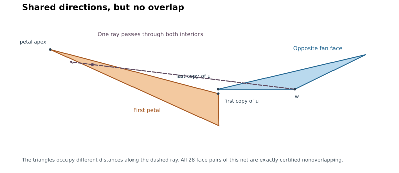

# Lemma L: local pairs at the slit

The claim remains open. Let `v` have maximum curvature among all six vertices,
let `w` be its antipode, and slit at an equator vertex `u` of maximum equator
curvature. The three pairs to exclude are the first and last petals, and each
of those petals against the fan face at the opposite side of the slit.

The hinge reduction in Lemma F assumes these local pairs do not overlap. It
cannot be used to prove L without an independent argument.

## Angular separation about w is also too strong

The one-hour continuation produced a stronger obstruction than the earlier
bisector example: **no line through w separates one flank petal from the
opposite fan face**, even under both curvature selection rules. Their angular
cones overlap, but their distances from w keep the actual faces disjoint.



The exact integer points are

```
0=(-100,  0,-3)   1=( 62,14,-1)   2=(57,-22, 0)
3=( -80, -1, 2)   4=( -8, 4, 4)   5=(69,  5,-1).
```

Here `v=0`, `w=4`, the slit is at `u=2`, and the slit-based equator is
`(2,5,1,3)`. The first petal is `V_0=(0,2,5)` and the opposite fan face is
`W_3=(4,3,2)`. The cuts are `01,02,03,05,24`.

Develop this pair in one common net frame. The checker proves that the ray
from w to the petal apex lies strictly inside the fan face's angular cone.
It also checks a ray through the petal's interior point with barycentric
weights `(3/4,1/8,1/8)`. This ray therefore passes through both face interiors,
at different distances. No line through w can put the whole fan face on one
side and that interior petal point on the other. These assertions follow from
strict rational determinant bounds, with the hull and both curvature rankings
checked first.

Independently, the full-net certificate verifies all 28 pairs: 19 uncut
vertex-fan checks and nine separating-edge checks. Thus **Lemma L is not
refuted**. What fails is the stronger proposal to prove it entirely by disjoint
angular sectors centered at w. A complete proof must include distance or other
information beyond that proposed angular separation. In particular, replacing
the bisector by a better-chosen line through w does not repair this approach.

```
python3 -m n6.local_radial n6/results/local-radial-failure.certificate.json
python3 -m n6.polycert verify n6/results/local-radial-failure.certificate.json
```

The drawing is illustrative; both proof verdicts come from the exact checker.

## Distance information repairs the angular failure for this example

For a fan triangle with vertices 0,a,b and det(a,b)>0, write a point as
x=lambda*a+mu*b. Its fan directions have lambda,mu>=0, and the outer fan
edge has lambda+mu=1. On a fixed ray, lambda+mu is exactly the ratio between
the point's distance from w and that outer edge's distance from w.

For the saved local example all three petal vertices have mu>0. Only its
apex has lambda>0. Clipping the petal to the fan directions therefore gives
a triangle with just three extreme points: the apex and the intersections
of its two incident edges with lambda=0. The linear function lambda+mu
attains its minimum at one of these three points. At a crossing between
p and q the value is

```
(p_lambda*q_mu - q_lambda*p_mu)/(p_lambda-q_lambda).
```

The three exact outward enclosures lie near 5.3922, 2.0406, and 1.21722.
The independent checker proves that all three exceed **1217/1000**. Thus on
**every shared ray**, the petal begins at least 21.7% farther from w than the
fan's outer edge. This is a finite, distance-sensitive proof for this
particular pair, despite its overlapping angular ranges.

The clipping argument is a general elementary lemma for the stated sign
pattern. The 1.217 clearance is specific to this witness, not a universal
constant or a proof of Lemma L. Other sign patterns and the petal/petal
local pair still require treatment.

```
python3 -m n6.local_radial n6/results/local-radial-failure.certificate.json
```

## Exact rejection of a proposed bisector shortcut

Let the two copies of `u` be `u+` and `u-`. They have equal distance from `w`,
so their perpendicular bisector passes through `w`. It is tempting to put each
flank petal entirely in the half-plane containing its own copy of `u`. This
would give a convenient local separator. That condition is **false under both
curvature selection rules**, even though the selected net can still be simple.

An exact integer-coordinate example is

```
0=( 28,-333, 110)   1=(-14, 380, -85)   2=(-12, -17, -24)
3=(-23,-386,   2)   4=(-61,-220,-109)   5=(-22, 665,-154).
```

Here `v=5`, `w=2`, and the slit vertex is `u=0`. The checker verifies the
octahedral hull, the maximum-curvature choices, and that the last petal's apex
is closer to the **other** copy of `u` than to its own. The squared-distance
difference has a strictly negative rational enclosure (approximately `-2.113`).
That is an exact failure of the proposed half-plane condition. Independently,
all 28 face pairs of the same unfolding are certified nonoverlapping.

```
python3 -m n6.bisector n6/results/local-bisector-failure.certificate.json --bits 80
python3 -m n6.polycert verify n6/results/local-bisector-failure.certificate.json
```

For comparison with angle-based work, put `delta=kappa_w/2`, `r=|wu|`,
`s=|vu|`, and let `e` be the two-face angle at `u` in one flank quadrilateral.
Its signed bisector expression is `r sin(delta)+s sin(e-delta)`. The checker
avoids inverse trigonometry by using the equivalent squared-distance test.
Failure of that sufficient expression is not a failure of L.

## A numerical overlap candidate was resolved exactly

The directed search in `local_probe.py` examined 200,000 valid selected
configurations. Its largest tiny positive overlap score was about `2.60e-8`
in a nearly degenerate shape. Interpreting the saved decimal coordinates as
exact rationals, the independent checker confirms the selected apex and slit
and proves the whole net nonoverlapping, using 320 fractional bits. Thus this
saved candidate supplies a regression for numerical error, not a counterexample.

```
python3 -m n6.point_audit n6/results/local-directed.json --output n6/results/local-directed-audit
python3 -m n6.polycert verify n6/results/local-directed-audit.selected.certificate.json --bits 320
```

The numerical search itself is not a proof of the universal statement. Higher
precision only makes an interval calculation more decisive; every accepted sign
still follows from outward rational bounds.

## Useful curvature bound

The slit rule alone and Gauss--Bonnet imply

```
kappa_u+kappa_w >= pi-kappa_v/4+3 kappa_w/4.
```

For every face angle `nu_t` at `v`, the convex-vertex cone inequality gives
`nu_t <= pi-kappa_v/2`, so

```
kappa_u+kappa_w-nu_t >= (kappa_v+3 kappa_w)/4 > 0.
```

This is a proved inequality, but does not yet exclude the local overlaps. The
old suggestion that the entire range `kappa_u+kappa_w>=pi` was already proved
needs a written argument accounting for every angle branch. It is not counted
as established here.

## What the elementary gap bound actually proves

Unwrap the fan angles so the first slit ray has direction zero and the last
has direction `Theta=2 pi-kappa_w`. Write the angular ranges of the first and
last two-face quadrilaterals as

```
[-B, omega_first+F_first],
[Theta-omega_last-B_last, Theta+F].
```

Here `B,F>=0` are their extensions past the respective slit rays. If `e,f`
are the two quadrilateral angles at the copies of `u`, then
`e+f=2 pi-kappa_u`. An extension B is possible only for `e>pi`; in that case
the triangle formed by w, u and the petal apex gives `B<e-pi`. Likewise
`F<f-pi` when `f>pi`. At most one of e,f can exceed pi. Consequently

```
B+F < pi-kappa_u <= kappa_w
```

when an extension is positive and `kappa_u+kappa_w>=pi`; when neither is
positive, `B+F=0<kappa_w`. Thus the two angular ranges cannot meet by wrapping
across the zero/full-turn cut: `Theta+F<2 pi-B`.

This is a proved exclusion of that particular angular mechanism, with no
ranking assumptions. It leaves the possible ordinary overlap of the unwrapped
ranges on the other side of the fan. Angular range overlap is itself only a
necessary condition for triangle overlap. A complete proof of L must address
the remaining mechanism; the gap bound alone is insufficient.
