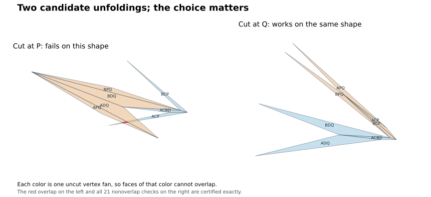

# Octahedron minus an edge: a two-choice unfolding conjecture

9 September 2026. **The universal claim below remains open.** This session
changes the research target from enlarging one box to proving a small,
explicit tree family sufficient for every convex realization.

## The proposed algorithm

Label the quadrilateral **A–C–B–D**, in boundary order. A and B have degree
four; C and D have degree three. The two vertices outside its plane are P
and Q. P is adjacent to C, and Q is adjacent to D. The seven original faces
are

```
ACBD, ACP, APQ, ADQ, BDQ, BPQ, BCP.
```

Repository indices are A=0, B=1, C=2, D=3, P=4, Q=5. No diagonal is added to
ACBD. Fix the corner A and consider just these two cut trees:

| Choice | Original edges to cut |
|---|---|
| T_P | PA, PB, PC, PQ, AD |
| T_Q | QA, QB, QD, QP, AC |

Each consists of the four edges at an off-quadrilateral vertex, plus the
edge from its one nonneighbor to A. Each is a spanning tree, so its uncut
dual edges develop the entire surface into one connected net.

**Conjecture.** For every full-dimensional convex polyhedron with exactly
these original facets, at least one of T_P and T_Q has no positive-area
overlap. Boundary contact is allowed. The statement makes no curvature,
edge-length, thickness, or coordinate-box restriction.

The proposed algorithm tries T_P and checks it; if it overlaps, it tries
T_Q. The conjecture would guarantee success after at most two candidates.
Choosing B instead of A gives an equivalent universal conjecture by
relabeling. The conjecture concerns either fixed choice of corner, not a
post-hoc choice among four trees.

`minus_pair.select_certificate` implements a conservative version: it tries
both trees and returns a separately replayed rational-interval certificate
when possible. If neither is certified, it returns **unresolved**. Inconclusive
interval estimates, including near-contact cases, are not evidence of overlap.

## The geometric pattern: two fans, regrouped

In T_P, the surface splits into two uncut vertex fans:

- the fan at C: ACBD, ACP, BCP;
- the fan at Q: APQ, ADQ, BDQ, BPQ.

These two patches are joined along BD. In T_Q, regroup the same surface as
the fan at D (ACBD, ADQ, BDQ) and the fan at P (ACP, APQ, BPQ, BCP), joined
along BC.

Each fan is internally nonoverlapping: its faces develop consecutively
around one vertex, with total angle less than 2π by convexity. The difficulty
is exclusively overlap between the two patches. Thus a useful target lemma
is: **if the C/Q fan arrangement overlaps, the D/P arrangement does not.**
That implication still needs a proof; the fan decomposition alone does not
establish it. It suggests studying the boundaries of two patches together
instead of imposing a curvature ranking on a single cut.

## What the saved solutions actually showed

The old complete box certificate selected nine trees on 409 closed cells.
However, a fresh numerical check of **all 224 trees at every cell center**
found all 224 successful at all 409 centers. These 91,616 numerical checks
do not certify the surrounding cells, but they show why the selected
witnesses should not be read as uniquely necessary geometric choices.

A discovery corpus of 3,000 + 20,000 generated convex shapes left ten pairs
of degree-four stars that covered every sample. The pair above was selected
for its simple symmetry and fan interpretation. A separate seed then
generated a **10,000-shape holdout**, with no failure of either fixed-corner
version of this pair. Every sampled success was measured with a positive
margin greater than 10^-9 after diameter normalization.

The generator mixes varied quadrilateral roofs, positive-denominator
projective transformations, and anisotropic affine distortions. It screens
the original facet supports and retains the whole quadrilateral. This is
**not exhaustive**, does not define a uniform measure on shapes, and excludes
numerically unresolved degeneracies. Neither 33,000 successes nor their
absence of failures is a universal proof.

An additional directed search used 150 starts and 244,982 objective calls
(187,744 passed its floating facet screen). It found no failure above its
10^-8 threshold. Its worst result was about -5×10^-16, at nearly flat
coordinates. At 240-bit rational interval precision, the exact decimal
reconstruction has one failing tree and one successful tree. Thus it is not
a counterexample to the pair. The report is
`results/minus-pair-directed-audit.verification.json`.

## Exact progress: one tree covers the old box

The same ten-parameter domain previously covered by nine trees now has a
certificate using **T_P alone**, with 16 closed cells. The domain and center
are exactly those in [REGION_COVER.md](REGION_COVER.md): each parameter varies
independently by ±1/20. There is no enlargement or change of coordinates.

Independent replay checks all 16×21 = **336 face pairs**: 224 by uncut
vertex fans and 112 by exact separating-edge bounds. All facet supports,
quadrilateral planarity identities, and subdivision boundaries are checked.
The earlier 409-cell certificate remains valid historical evidence.

This proves a simple special case of the proposed algorithm on a continuous
family. It does **not** prove that T_P alone works globally, or that the
two-tree family covers every realization.

## Exact failures tell us which choices are necessary

For

```
A=(0,0,0), B=(10,0,0), C=(16,-3,0), D=(-42,13,0),
P=(-58,0,-6), Q=(-133,9,-10),
```

T_P has positive-area overlap between ACP and ADQ. T_Q is exactly certified
nonoverlapping for all 21 face pairs. Swapping C↔D and P↔Q, and reflecting
space to retain the face orientations, supplies the opposite example:
T_Q fails and T_P succeeds. Neither of these two trees alone is universal.
This does not assert that every other fixed tree fails.



A different exact example,

```
A=(0,0,0), B=(10,0,0), C=(18,-5,0), D=(-27,10,0),
P=(22,-5,-1), Q=(-62,24,-5),
```

defeats **all four** near-stars based at A or B with the extra route confined
to the quadrilateral boundary. This refutes that four-tree family, not
unfoldability or the two off-quadrilateral trees.

Simple numerical selection shortcuts also fail: on the holdout, selecting
the sharper of P,Q and always using the route via A fails on 524 of 10,000
shapes. That count is numerical evidence against the shortcut; the integer
switching example above is an exact reason to retain a choice between trees.

## A finite, explicit proof target

The shared-vertex lemma disposes of 14 of the 21 face pairs in each tree.
The seven residual pairs of T_P, by repository face indices, are

```
(0,2), (1,2), (1,3), (1,4), (1,5), (2,6), (3,6).
```

Those of T_Q are

```
(0,2), (1,3), (1,4), (2,3), (2,4), (3,5), (3,6).
```

Simultaneous failure requires one residual pair from each list to overlap:
49 possible combinations. The label involution C↔D, P↔Q exchanges the trees
and maps the face indices by (1 3)(4 6), fixing 0,2,5. It pairs the 49
combinations, with seven fixed combinations, giving **28 symmetry classes**.
An orientation-reversing spatial reflection restores the chosen face
orientation without changing lengths or overlaps. Therefore excluding these
28 classes for all convex realizations would prove the conjecture.

This is an exhaustive combinatorial reduction, **not 28 solved geometric
cases**. No whole class has been eliminated here. Several classes may be
settled together by one fan-boundary lemma; their number is not an estimate
of effort remaining. The next proof attempt should exploit the shared
quadrilateral and convexity to show that the two different fan arrangements
cannot both overlap.

## Reproduction

From the repository root, use the research virtual environment for numerical
work. Exact replay below uses only Python's standard library.

```
python3 -m n6.minus_pair verify n6/results/minus-quad-paths.certificate.json
python3 -m n6.minus_pair verify n6/results/minus-pair-switch.certificate.json
python3 -m n6.minus_pair verify n6/results/minus-pair-switch-reflected.certificate.json
python3 -m n6.cover verify n6/results/minus-pair-cover.certificate.json.gz
python3 -m n6.minus_pair obligations
```

For the directed near-flat audit, use:

```
python3 -m n6.minus_pair verify n6/results/minus-pair-directed-audit.certificate.json --bits 240
```

Its saved verification report records this precision.
`python3 -m n6.minus_pair generate` regenerates the three integer examples.
`python3 -m n6.minus_pair unfold INPUT.json` tries the two-tree rule on a
labelled `n6-polyhedron-region-v1` input and returns a certificate or unresolved.

```
durer_small_n/.venv/bin/python -m n6.minus_pair cover
durer_small_n/.venv/bin/python -m n6.minus_patterns --mode centers --samples 409 --seconds 120 --output n6/results/minus-pattern-centers.json
durer_small_n/.venv/bin/python -m n6.minus_patterns --mode random --samples 20000 --seconds 240 --seed 6090921 --output n6/results/minus-pattern-rules.json
durer_small_n/.venv/bin/python -m n6.minus_patterns --mode random --samples 10000 --seconds 180 --seed 6090923 --output n6/results/minus-pattern-pair-holdout.json
durer_small_n/.venv/bin/python -m n6.minus_search --seconds 180 --seed 6090922 --output n6/results/minus-pair-directed.json
```

Commands replace their named output reports. Keep distinct filenames when
preserving successive runs. Time-limited runs record the actual sample count.
